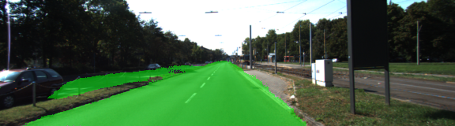
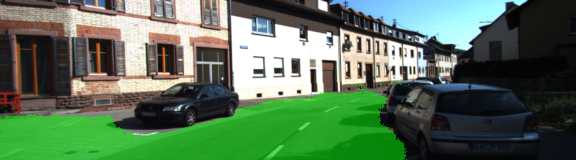
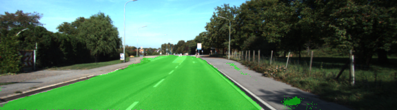
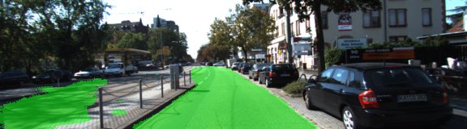
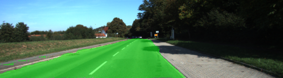
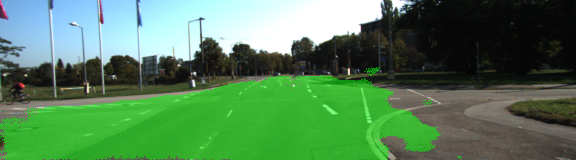
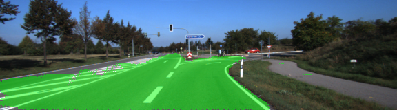
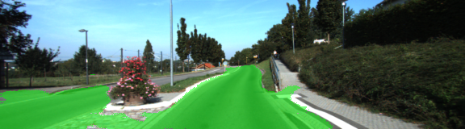

# CarND-Semantic-Segmentation
This is my implementaiton of udacity Self Driving Car Nano degree CarND-Semantic-Segmentation
https://github.com/udacity/CarND-Semantic-Segmentation

The goal if this project is to train a FNN (Fully Convolutional Network) to identify pixels that are of road that the car is currently driving on.

#Implementation
The FNN being trained here is based on VGG16 CNN (Convolutional Neural Network). To optain a output space of the original image, transposed convolutions layers are added to upsample the output of the VGG16 network. Skip connections from various layers of the VGG16 network is also added to make sure that our FNN is making use of information from multiple different resolutions.

In particular the functions that were implemented for the project were, 
* load_vgg() : loads VGG16 CNN model
* layers() : implement the FNN by adding transposed convolutions and skip layers
* optimize() : define logits and loss, and eventually calls AdamOptimizer to minizie the loss
* train_nn() : for each epoc loop through training data in batches and train our FNN model
* run() : calls the above functions to build and train our FNN model and run the model on test data images 

To be abe to train the network in reasonable amount of time. I have decided to set up a google cloud GPU instance to run the project. 
After playing with some hyper parameters, I have come to conclusion that training rate lower than 0.00001 are likely too low, and take a long time to converge while 0.0001 are large enough that it does not necessary alwayse converge to a number lower than 0.03. In general a trainig rate between 0.00001 and 0.00005 seems to prodce reasonable result with epoc between 100 and 150 with batch_size between 5 to 10. A training epoc much higher than 150 at such training rate might cause over fitting. I have not played with the dropout_rateand have just kept it at 0.5.

I was able to obtain a training loss of 0.0166431 with the following hyper parameters
* training_rate = 0.00005
* epoc = 150
* batch_size = 5
* dropout_rate = 0.5

Below are some of the result of running the FNN model on test images

